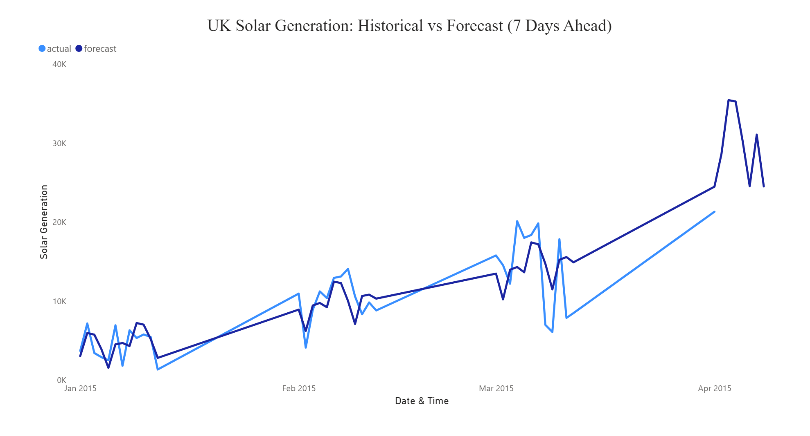

# Solar Energy Forecasting Dashboard

This project explores how we can use open energy data and forecasting models to better understand short-term trends in solar power generation. The goal was to build a simple but useful dashboard that shows both historical and predicted solar output, using real hourly weather data from the UK.

## 📌 Project Motivation

As interest in renewable energy grows, the ability to forecast solar generation becomes more important — for grid operators, policymakers, and sustainability teams alike. I wanted to explore how a data analyst could contribute to this problem using publicly available data, Python, and Power BI.

This project was also a way for me to practice working end-to-end: cleaning real-world data, building a forecasting model, and presenting the results in a clear, visual format.

## 🛠 Tools & Methods

- **Data Source**: Open EU/UK solar energy dataset (hourly)
- **Modeling**: [Facebook Prophet](https://facebook.github.io/prophet/) for time-series forecasting
- **Cleaning**:
  - Filtered out zero or negative solar generation values
  - Parsed datetime and clipped top 5% of values to reduce outliers
- **Forecasting**:
  - Trained model on historical hourly data
  - Forecasted solar output for the next 7 days
- **Visualization**: Built a two-page Power BI report to compare actual and forecasted trends

## 📊 Dashboard Overview

The Power BI dashboard includes:

- A time-series line chart comparing historical and forecasted energy output
- Clear axis labels, legend, and layout across two report pages
- A simple design focused on readability and storytelling

> 


## 💡 Key Insights

- The model captured the general pattern of daily solar output, including typical rises and falls across hours.
- Forecasting works best when data is clean and focused — trimming extreme outliers helped reduce noise.
- Power BI allowed for a straightforward way to present both historical and forecasted trends side by side.

## 📁 Files Included

- `solar_data_raw.csv` – Original dataset (UK hourly energy + weather)
- `solar_data_cleaned.csv` – Preprocessed version for Prophet
- `solar_forecast_output.csv` – Combined actual and forecasted results
- `solar_forecasting_prophet.py` – Python code for training + prediction
- `solar_forecast_dashboard.pbix` – Final Power BI dashboard file

## 🚀 What I Learned

- How to use Prophet for time-series forecasting with minimal setup
- How to prepare and clean messy real-world time data
- How to communicate results visually using Power BI

## 📦 Optional Dependencies

If you want to run the forecasting script:

```bash
pip install pandas prophet matplotlib
